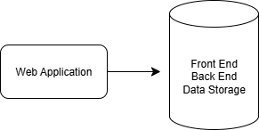
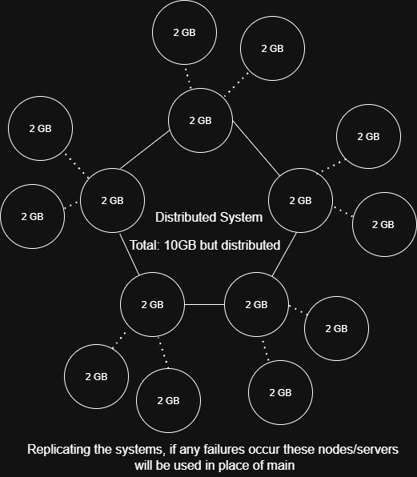
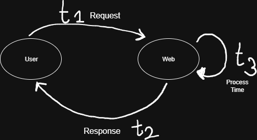
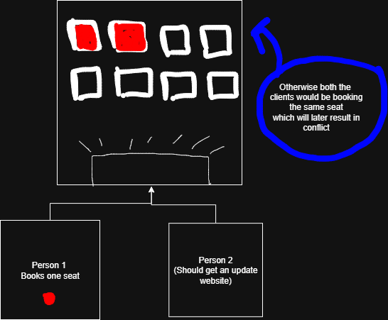
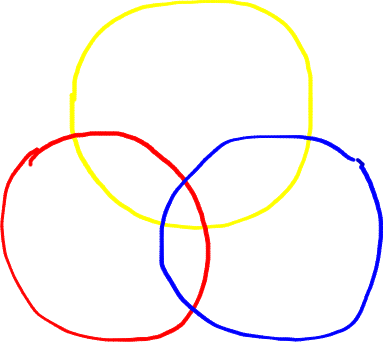

# System Design

**System Design** is the process of defining the **architecture**, **components**, **data flow**, and **interfaces** of a software system with the goal of meeting specific functional and non-functional requirements such as:

1. Scalability  
2. Reliability  
3. Availability  
4. Maintainability  
5. Performance  

> *System Design is about designing how a complete software system works from the inside out — not just writing code, but thinking deeply about how parts interact, how data flows, how users engage with the system, and how it behaves at scale.*

---

##  When to Use System Design

System design becomes essential when:

1. You're building something larger than a simple script or basic app — especially if it's user-facing or meant to scale.
2. You need to ensure the system can handle:
   - **Scalability** (millions of users or operations)
   - **Reliability** (survive failures or downtime)
   - **Performance** (fast responses under load)
   - **Security** (safe access and data protection)
3. You're designing:
   - Backend infrastructure  
   - Distributed systems  
   - Microservices architecture  
   - Cloud-based applications  
   - Data-intensive pipelines  

---

##  Types of System Design

### 1. HLD – High Level Design

**HLD** is the architectural blueprint of the entire system. It answers the **"what"** and **"how"** at a broader, system-wide level.

####  Purpose:
- Defines how components interact  
- Focuses on scalability, availability, security, and tech stack choices  
- Identifies major modules, APIs, databases, servers, etc.  

####  HLD Includes:
- System architecture diagrams (e.g. `Client ↔ Load Balancer ↔ Backend ↔ DB`)  
- Microservices/modules and their responsibilities  
- Communication patterns (REST APIs, Message Queues, etc.)  
- Tech stack selection  
- Database choices and high-level schema  
- Scalability & fault-tolerance strategies (e.g. CDN, Replication)

> *Think of HLD like city planning — roads, districts, power grids, and water lines.*

---

### 2. LLD – Low Level Design

**LLD** is the detailed internal design of each component defined in HLD. It answers the **"how exactly"** questions — like creating blueprints for individual buildings in your city.

#### Purpose:
- Describes internal logic, classes, data models, algorithms, and workflows  
- Helps developers understand exactly what needs to be built  

#### LLD Includes:
- Class diagrams  
- Object relationships  
- API contract details (endpoints, parameters, response models)  
- Database table structures  
- Function definitions or pseudocode  
- Internal business logic breakdown  

---
# Types of Architecture Design
## A. Monolithic Architecture: 
If all the components and functionalities of a project are entangled and combined in a single codebase, then it is called a monolithic architecture.

***Monolithic Architecture has less complexity -> Easy to understand -> Higher production***
-> Also know as Centralised system.

### Why it is good?
1. In monolithic architecture all the modules are present in a single system, so they require fewer network calls.
2. It is comparatively easy to get secured.

### Disadvantages:
1. In monolithic architecture, every module is combined in a single system, so if there is an error or bug in a single module, it can destroy the complete system.
2. In monolithic architecture, whenever a single module is updated, the whole system needs to be updated to reflect the changes to the users. All modules are present in a single system and are connected to one another, so the whole system needs to be updated.
3. If there is any change in a single module's programming language or framework, it will affect the entire system.

## B. Distributed System:
A distributed system is a collection of multiple individual system's connected through a network that shares resources, communicate and coordinate to achieve a common goal.
(different modules are connected to each others to accomplish a single goal)

### Advantages:
- Scalable (We can easily add more machines to handle increased load -> scale horizontally)
- No single point of failure (If one machine fails, the system can continue functionally by rerouting tasks to others)
- Low Latency

### Disadvantages:
- Complexity (hard to design, develop and maintain)
- Management requirements
- Difficult to secure
- Message may be lost in between nodes

Example:-
   ***Google Search Engine - uses thousands of distributed servers worldwide to handle billions of queries***

---

# Latency: 
It is the time delay between a user's action and the system's response.

**Latency = network delay + computational delay**
In Monolithic => Latency = computational delay (as a single component)
In Distributed System => Latency = network delay + computational delay

  
 Total time = t1 + t2 + t3
### Ways to Reduce Latency:
1. Caching - Store frequently accessed data in memory, reduces repeated trips to the database.
2. CDN (Content Delivery Network) - CDNs are geographically distributed networks of proxy server.
---

# Throughput:-
Amount of work a system can process in a given period of time:
-> It is usually measured as **bits per second (bps)**. {Number of requests per second}

### Causes of low throughput:
 - Latency
 - Protocol Overhead (To and fro communication between server)
 - Congestion

### Improving throughput:
 - Use LoadBalancers
 - Use Distributed System
 - Caching
 - CDN

---

# Availability:-
Percentage of time a system is operational and accessible to its users.
-> Availability = Uptime/Uptime + Downtime X 100%

### How to increase?
- Replication {includes redundancy, but involves the copying of data from one node to another or the synchronization of states between nodes}
- Distributed System
- Redundancy {Redundancy is the duplication of nodes, in case of some of them may or do fail}

### Why Distributed Systems often have higher Availability?
- Redundancy: Data and services can be replicated across nodes and regions.
- Load Balancing: Traffic can be redirected to healthy nodes during failures.
- Partial Failure Tolerance: One part can fail without taking down the whole system.

Example:- 
Distributed System: Netfilx -> If one server fails, the load balancer routes users to another region
Monolithic: A Legacy payroll app hosted on one or premise server if that servers PSU fails, payroll is down untill repairs.

---  

# Consistency
When more than one client requests the system, for all such requests, it will be called consistent when each client gets the same data.
The data should always be consistent regardless of who is accessing it.

### Dirty Read:- 
When more than one client requests the system, for all such requests when different clients get different responses due to some recent update that has not been committed to all systems yet, this reading operation is called dirty read.

### Factors Imporving Consistency:
- Improving Network Bandwidht
- Stopping the read operation
- Replication based on distance aware strategies (keeping server close to each other geographically)

## Types of Consistency:
1. Strong Consistency - When the system doesnt allow read operations untill all the nodes with replicated data are updated. (no dirty reads)
2. Eventual Consistency - User read requests are not halted till all the replica's are updated, rather it updates the process eventaully. Some user's may recieve old data but eventually all the data is updated to the latest data.
3. Weak Consistency - Weak Consistency means that in a distributed system, after you update a value, not all nodes are guaranteed to have the updated data immediately, and there’s no strict guarantee on when they will become consistent.

---
# CAP Theorem:
It states that it is possible to attain only two properties and the third would be always compromised.
C -> Consistency
A -> Availability
P -> Partition Tolerance

1. Consistency:- All nodes see the same data at the same time
    If you read after a write, you get the latest value.
    Example: In a bank system, after transferring money, both your account and the receivers account show the updated balance instantly
    
2. Availability:- Every request gets a (non-error) response - even if its not the latest data.
    The system is always operational for reads/writes.
   
3. Partition Tolerance:- The system continues to operate despite network failures that split it into parts.
    In real world distributed system, Partition Tolerance is unavoidable (network can fail)
